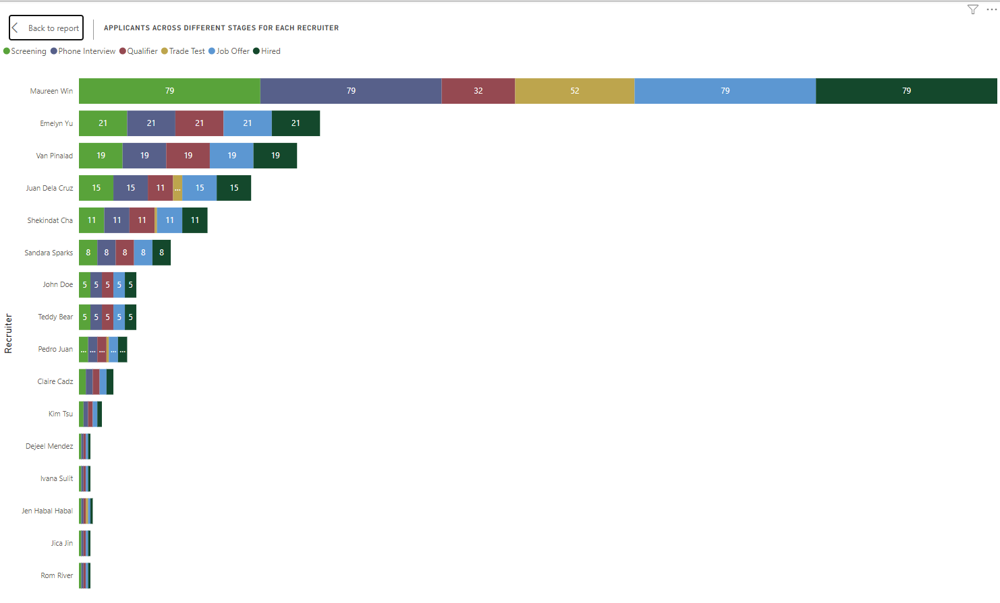

# Recruitment Analysis and Reporting Dashboard

This project aims to analyze recruitment data to provide insights into recruiter performance, applicant distribution, and time-to-hire metrics. Using Power BI, various interactive dashboards have been created to help recruitment teams optimize their processes and improve hiring efficiency. Below are the key components of the dashboard and the reports generated, as well as instructions for replicating the analysis.

## Features and Reports

### 1. Applicants by Recruiter and Stage
   - **Objective:** Display the number of applicants each recruiter is assigned, segmented by different stages in the recruitment process, such as applied, interview, offer, and hired.
   - **Metrics Included:** Number of applicants at each stage, recruiter breakdown, and totals.
   - **Visualizations:**  
  
   "Applicants Across Different Stages For Each Recruiter": A stacked bar chart that visualizes the distribution of applicants across various stages for each recruiter, such as Screening, Phone Interview, Qualifier, Trade Test, Job Offer, and Hired.  
"Average Time Applicant Spent on Each Stage": A line chart showing the average time applicants spend in each recruitment stage, helping to identify potential bottlenecks in the process. Different colored lines represent stages like Screening, Phone Interview, Qualifier, Trade Test, and Hired.

### 2. Recruiter Performance Comparison
   - **Objective:** Compare recruiter performance in terms of the number of applicants handled and the progression percentage to each hiring stage.
   - **Metrics Included:** Applicants handled, progression rate to each stage (e.g., Screening, Interview, Trade Test, Offer).
   - **Visualizations:** Heatmaps and progression bars to visualize recruiter performance metrics.

### 3. Distribution of Applicants Across Recruiters
   - **Objective:** Identify if there is an uneven distribution of applicants across recruiters, highlighting any disparities.
   - **Metrics Included:** Percentage distribution of applicants per recruiter.
   - **Visualizations:** Pie charts and horizontal bar charts displaying applicant distribution.

### 4. Applicant-to-Hire Conversion Rate Over Time
   - **Objective:** Track and analyze applicant-to-hire conversion rates for each recruiter over a specific period.
   - **Metrics Included:** Conversion rate calculations segmented by quarters or months, trends, and seasonal variations.
   - **Visualizations:** Line charts showing conversion rate trends over time.

### 5. Average Time to Hire
   - **Objective:** Calculate and display the average time to hire for each recruiter, broken down by each recruitment stage.
   - **Metrics Included:** Average time spent at each stage, overall time to hire.
   - **Visualizations:** Line charts and tables summarizing time metrics.

### 6. Applicant Status Summary
   - **Objective:** Provide a snapshot of the current status of applicants (e.g., in-process, rejected, hired) for each recruiter.
   - **Metrics Included:** Status count and percentages per recruiter, historical trends.
   - **Visualizations:** Stacked bar charts and trend lines displaying applicant status progression over time.

### 7. Tracking Recruiter Efficiency Over Time
   - **Objective:** Measure recruiter efficiency through metrics such as the number of applicants processed, time to first contact, and time spent in each stage.
   - **Metrics Included:** Applicants processed, average time metrics, stage time analysis.
   - **Visualizations:** Time series charts and tables tracking efficiency metrics over time.

## Data Source and Processing
The recruitment data used for this analysis was imported from an Excel file containing information about applicants, recruiters, and recruitment stages. The data underwent cleaning and transformation processes to ensure accuracy and consistency before visualization.

## Tools and Technologies
- **Power BI**: Used for creating dashboards and data visualizations.
- **Excel**: Initial data processing and transformation.
- **Power Query and DAX (Data Analysis Expressions)**: Employed for data manipulation, calculations, and dynamic measures.

## Acknowledgments
Special thanks to the Human Resource Department of Sta. Clara International Corporation for providing the opportunity to work on this analysis project.
